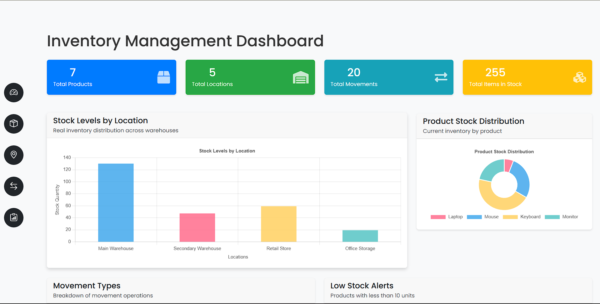
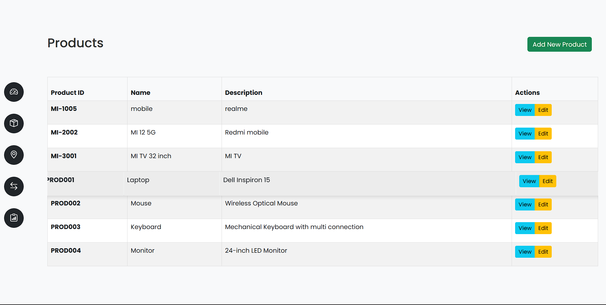
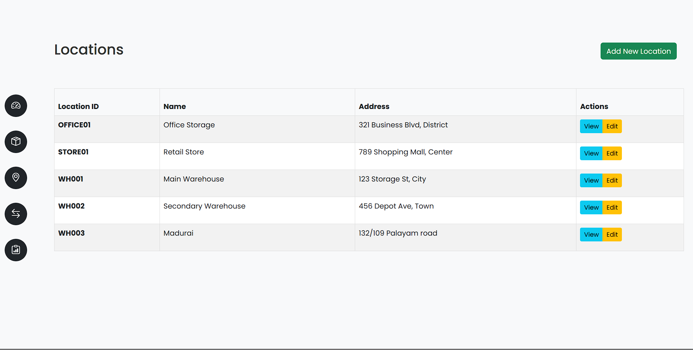
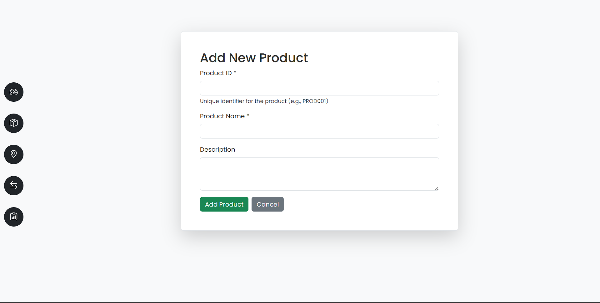
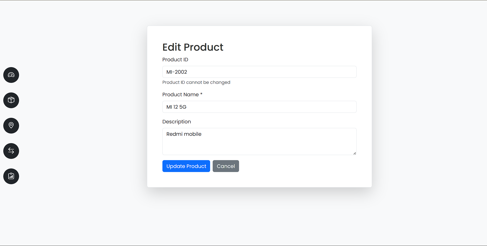
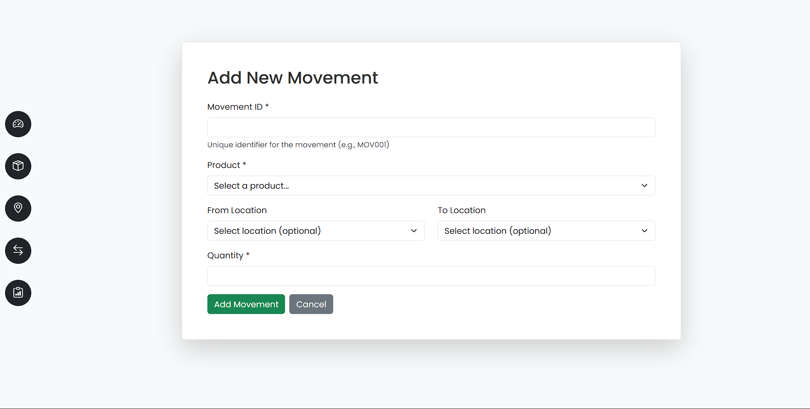

# Inventory Management System

A web-based inventory management system built with Flask that helps track products, locations, and movement of items across different locations.

## Features

- **Dashboard**
  - Show the options that we make changes in inventory
  - Track all details including products, movements, and locations
  

- **Product Management**
  - Add, edit, and delete products
  - Track product details including name, code, and description
  

- **Location Management**
  - Create and manage multiple storage locations
  - Edit and view location details
  

- **Movement Tracking**
  - Record product movements between locations
  - Track quantities moved and maintain movement history
  

- **Balance Report**
  - View current stock levels across all locations
  - Filter and search functionality
  

## Technology Stack

- Backend: Python Flask
- Database: SQLite
- Frontend: HTML, Bootstrap CSS
- Template Engine: Jinja2

## Setup and Installation

1. Clone the repository
```bash
git clone https://github.com/Sujeeth-P/Inventory-management.git
cd Inventory-management
```

2. Create and activate virtual environment
```bash
python -m venv venv
.\venv\Scripts\activate  # For Windows
```

3. Install dependencies
```bash
pip install flask
```

4. Run the application
```bash
python app.py
```

5. Access the application at `http://localhost:5000`

## Database Schema

The application uses SQLite with the following tables:
- Products
- Locations
- Movements
- Balance Report

## Screenshots

### Add Product


### Edit Products


### Add Locations


### Edit Locations


### Add Movements


### Edit Movements

